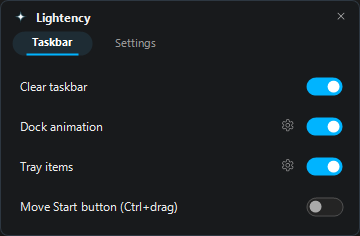
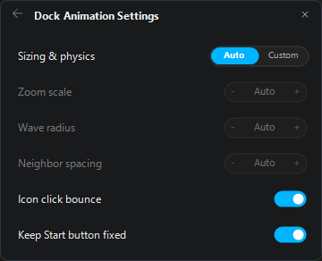

# Lightency

Native Windows 11 taskbar customization with a small footprint.

**Windows 11 · x64 · Native C++ · Portable**

> Customization should not cost you latency or FPS.

<p align="center">
  
  
</p>

## Features

- Clear taskbar with optional border removal
- Dock-style magnification and click bounce
- Automatic or custom animation tuning
- Individual tray item visibility
- Movable Start button
- Update checks without a resident updater service

No WebView, installer, or background browser process.

## Install

1. Download `Lightency-1.0.0-win-x64.zip` from [Releases](https://github.com/SashkoTadof/Lightency/releases).
2. Extract every file to a permanent folder.
3. Run `lightency.exe`.

Enable **Start with Windows** in Settings if needed.

## Why the name?

**Lightency** takes *light* and the tail of *latency*. The point is simple: keep the taskbar responsive and keep resource use low.

## How it stays light

- Native C++ UI and taskbar extension
- No always-running update service
- One update check at most every 24 hours
- Microsoft symbols are cached after the first lookup
- Settings are stored in a small local INI file

## Compatibility

- Windows 11 x64
- Per-monitor DPI scaling

Lightency works with the private XAML taskbar hosted by `explorer.exe`. A Windows update can temporarily affect Explorer-dependent features until compatible symbols are available. The first symbol lookup for dock animation requires internet access.

Unsigned builds may trigger generic antivirus warnings because the taskbar extension runs inside Explorer. Lightency does not use `WriteProcessMemory` or `CreateRemoteThread`.

## Updates

Automatic update checks can be disabled in Settings. Manual checks are available through **Check for updates**. When a new version is available, Lightency opens its official GitHub Release page; installation stays under your control.

## Uninstall

Disable **Start with Windows**, exit Lightency from the tray icon, and delete its folder. Optional cached data is stored in `%LOCALAPPDATA%\Lightency`.

## Build

Requires Visual Studio 2022 with MSVC and C++20, CMake 3.20+, the Windows SDK, and Debugging Tools for Windows.

```bat
build.bat
```

Output: `build\lightency-release`

## License

[MIT](LICENSE). MinHook uses the BSD 2-Clause license; see [third-party notices](THIRD_PARTY_NOTICES.md).
