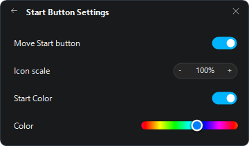
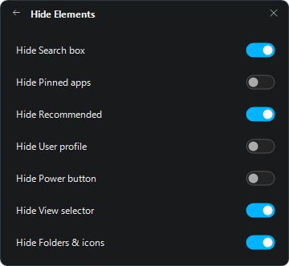

# Lightency

Native Windows 11 taskbar customization designed for minimal latency and low overhead.

**Windows 11 · x64 · Native C++20 · Portable**

> Customization should feel native, responsive, and stay out of the way of your frame rate.

<p align="center">
  
</p>

## Features

### Dock Animation & Physics
macOS-style dock hover magnification, icon bounce on click, and adaptive wave physics with custom curve, radius, and scaling controls.

<p align="center">
  
</p>

- **Clear taskbar**: Instant transparent taskbar with optional border removal.
- **Fluid dock animation**: macOS-style dock hover magnification and icon click bounce.
- **Fine-tuned physics**: Adaptive automatic or customized curve, wave radius, and scale.
- **Drag-and-drop assist**: Hover a taskbar app while dragging to bring its window forward.
- **Tray item control**: Granular visibility settings for system tray elements.

### Start Button & Start Menu
Customize the Start button appearance with a smooth hue color picker, custom sizing (50%–180%), and position adjustments. Control Start menu layout by hiding search, pinned apps, recommended items, user profile, or power buttons.

<p align="center">
  
  &nbsp;&nbsp;
  
</p>

- **Start Button customization**: Custom icon color with smooth hue slider, accent color sync, custom scaling (50%–180%), and position adjustments.
- **Start Menu control**: Granular visibility toggles for Search box, Pinned apps, Recommended, User profile, Power button, View selector, and Folders, plus simple/advanced sizing.
- **Window animations & borders (beta)**: Fluid window minimize animation effect and window border removal.
- **Lightweight & Portable**: Native executable and taskbar extension, no Electron/browser runtime or installer.
- **Built-in updater**: Fast in-app update check and release installer.

## Architecture & How It Works

Lightency consists of two coordinated native components:

- **`lightency.exe`** (Controller & UI):
  A standalone Win32 application that provides the settings GUI, manages the system tray icon, polls for GitHub releases, and monitors shell host processes.
- **`lightency_hook.dll`** (Shell Extension):
  A native C++20 library loaded into `explorer.exe` and `StartMenuExperienceHost.exe`.

### Execution Flow

1. **Standard Shell Hooks**:
   `lightency.exe` installs standard Windows thread hooks (`SetWindowsHookExW` with `WH_CALLWNDPROC` and `WH_GETMESSAGE`) targeting the shell tray and start menu threads. When messages are dispatched, the operating system naturally loads `lightency_hook.dll` into the process space. No `CreateRemoteThread`, `WriteProcessMemory`, or binary symbol patching is used.
2. **WinRT XAML Diagnostics**:
   Rather than downloading Microsoft debugging symbols (PDBs) or hardcoding function offsets that break on monthly Windows updates, `lightency_hook.dll` connects to the taskbar visual tree through the official Windows `InitializeXamlDiagnosticsEx` API. Visual elements are queried directly in-process.
3. **Inter-Process Configuration (IPC)**:
   Configuration parameters and toggle states are synchronized in real time between the controller and the hook using shared memory (`CreateFileMappingW` / `MapViewOfFile`), eliminating disk I/O and pipe latency.
4. **Network Access**:
   The hook and core engine run completely offline and never initiate network traffic. The only component with network access is the optional, user-triggered updater inside `lightency.exe`, which queries the public GitHub Releases API.
5. **Teardown & Cleanup**:
   On application exit, window messages instruct the hook to detach XAML event handlers (`PointerMoved`, `LayoutUpdated`, `CompositionTarget::Rendering`), reset element transforms back to stock taskbar geometry, and gracefully unload.

## Installation

1. Download `Lightency-1.1.1-win-x64.zip` from [Releases](https://github.com/SashkoTadof/Lightency/releases).
2. Extract the archive into any folder.
3. Launch `lightency.exe`.

*(Optional)* Enable **Launch at startup** in Settings for seamless launch on boot.

## Compatibility & Requirements

- **OS**: Windows 11 (x64)
- **Privileges**: Standard user privileges for typical desktop sessions. Running as Administrator may be required if managing windows of elevated applications or if specific Windows security policies restrict thread message hooks.
- **Displays**: Full Per-Monitor DPI scaling support (V2).

> **Note:** Unsigned shell extensions may occasionally trigger generic antivirus heuristics because code is executed in the `explorer.exe` process space via standard window hooks. Lightency uses standard Windows APIs (`SetWindowsHookExW`) and does not employ process injection routines.

## Building from source

Requirements: Visual Studio 2022 / Build Tools (C++20), Windows SDK (10.0.22621+), CMake 3.20+.

```cmd
build.bat
```

The output portable distribution and ZIP archive will be created in `build\`.

## License

Released under the [MIT License](LICENSE).
