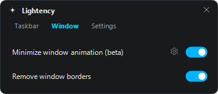

# Lightency

Windows 11 taskbar and start menu customization in native C++20.


## Features

### macOS-Style Dock Animations
Smooth icon scaling on hover with wave expansion, physics bounce, and auto-alignment.


### Minimal Start Menu & Custom Styling
Customize the Start button icon, match Windows accent colors, and strip clutter (search bar, recommended feed, pinned sections).


### Dynamic Window Animations & Borders
Subtle macOS-inspired minimize animations and custom window border styling.



---

### More Highlights
- **Transparent Taskbar**: clear acrylic/solid background with top border removal, fully working on Windows 11 24H2.
- **Smart Drag & Drop**: hover files over any taskbar icon to bring target windows into focus instantly.
- **System Tray Cleaner**: hide clutter items individually (clock, network, sound, battery, overflow chevron).
- **Zero Bloat**: single portable executable written in pure C++20, zero background services, zero telemetry.

## Architecture

Lightency consists of two parts:

- `lightency.exe`: Win32 controller, settings GUI, system tray icon, and self-updater.
- `lightency_hook.dll`: injected module running inside `explorer.exe` and `StartMenuExperienceHost.exe`.

### How it works

1. **Injection**: `lightency.exe` sets thread hooks (`SetWindowsHookExW` with `WH_CALLWNDPROC` and `WH_GETMESSAGE`) on taskbar and start menu threads. Hooks initialize lazily on IPC messages without thread creation inside `DllMain`.
2. **XAML access**: `lightency_hook.dll` hooks into the visual tree using the native `InitializeXamlDiagnosticsEx` API, modifying WinRT XAML elements in-process.
3. **IPC**: Settings are synchronized in real-time via lock-free atomic shared memory (`CreateFileMappingW` / `MapViewOfFile` with seqlock).
4. **Updater**: Performs atomic updates via `MoveFileW` with strict HTTPS enforcement, expected size validation, and native JSON parsing.
5. **Exit**: Event handlers and timers are detached, element transforms are restored, and hooks cleanly unregister.

## Download & Usage

1. Get the latest release from [Releases](https://github.com/SashkoTadof/Lightency/releases).
2. Extract the ZIP and run `lightency.exe`.

Settings can be opened from the system tray icon.

## Requirements & Notes

- **OS**: Windows 11 64-bit (including 25H2 / build 26200+).
- **Permissions**: Standard user permissions. Elevated privileges may be required when interacting with administrator windows.

## Build

Requires Visual Studio 2022 (C++20), Windows SDK 10.0.22621+, and CMake 3.20+.

```cmd
build.bat
```

Output files will be generated in `build\`.

## License

[MIT](LICENSE)
